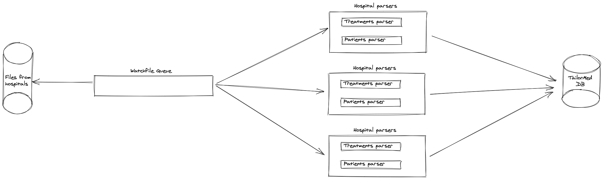

# ETL system in node.js

## Flow
1. "Watch" files
   1. FileWatcher recognize a new file inside the target folder.
   2. The ParserManager "choose" the right parser according to the file name.
   3. "FileChanged" event is invoked in case there is a parser for the file.
2. Parsing the files
   1. "General" CSV parser, parse the file and extract all the rows from the file in the form of key-value paires. 
   2. The relevant parser, convert the rows into Patient/Treatment objects.
3. Save the data in the DB

## Components
- FileWatcher - get updates about new files in the "csvs" folder
- ParserManager - a singleton class that contain the hospitals parsers
- MongoConnection and (Patient / Treatment) Models
- Logger - logs messages in a file and in the console

