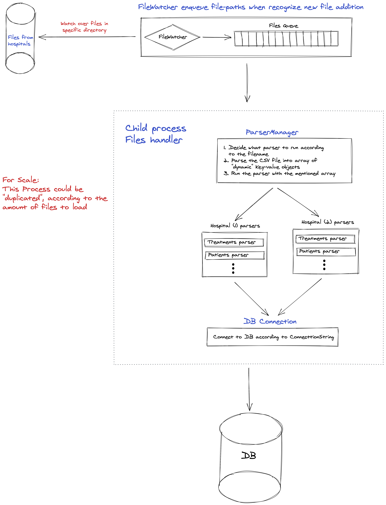

# ETL system in node.js

## Flow

1. "Watch" files
    1. FileWatcher recognize a new file inside the target folder.
    2. The ParserManager "choose" the right parser according to the file name.
    3. "FileChanged" event is invoked in case there is a parser for the file.
2. Parsing the files
    1. "General" CSV parser, parse the file and extract all the rows from the file in the form of key-value paires.
    2. The relevant parser, convert the rows into Patient/Treatment objects.
3. Save the data in the DB

## Components

- FileWatcher - get updates about new files in the "csvs" folder
- File Handler (Child process):
    - ParserManager - a singleton class that contain:
    - Hospital(s) parser(s) - each parser "knows" what data it should get and parse/convert it to object in the DB
    - DB Connection and (Patient / Treatment) Models

### Logs

logs messages are printed to the console and to a file in `.logs/trace.log`

### Running the project

1. Run `yarn install` or `npm install` to install all the dependencies for the project
2. Start the docker containers by running `docker-compose up -d` command 
This will start 2 containers:
    1. MongoDB - to save the data
    2. Redis - to save events for the [Queue](https://github.com/bee-queue/bee-queue)
3. Run the watcher, and the handlers 
by running `yarn start` or `npm start`

